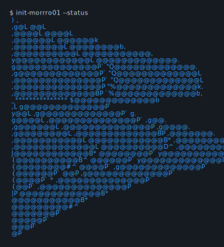

<table border="0" align="center">
    <tr>
        <td align="center" width="324" rowspan="3" border="0">
            
        </td>
        <td align="center" width="440" border="0">
            
    </tr>
    <tr></tr>
    <tr>
        <td align="center" width="440" border="0">
            
        </td>
    </tr>
</table>
